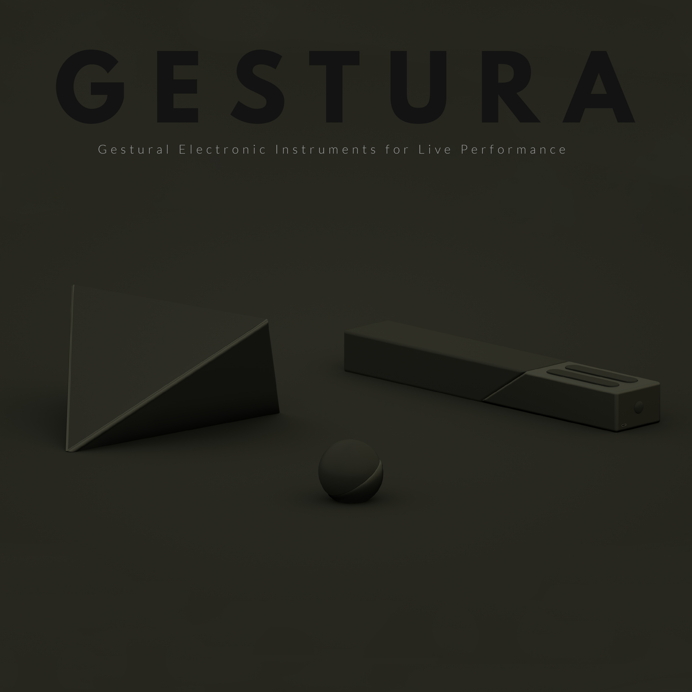

# Gestura
> This is the current codebase for Gestura instruments, currently supporting Gestura Bend and Wave

Gestura is a family of gestural electronic instruments I designed during my first semester at Parsons for Industrial Design. Current code is only a functional prototype for testing purposes + proof of concept. 

